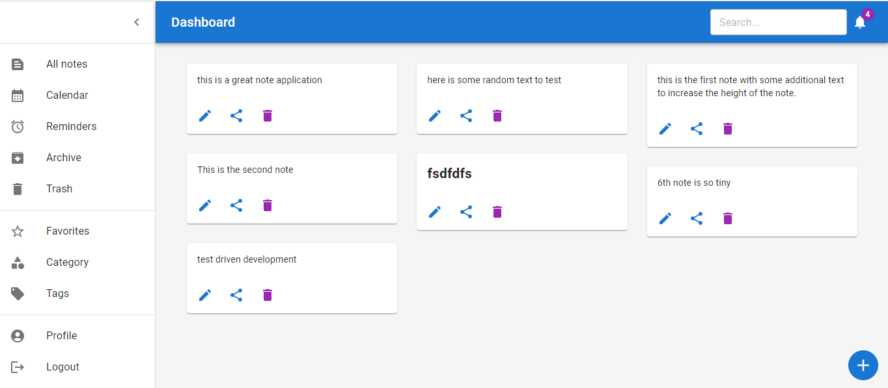
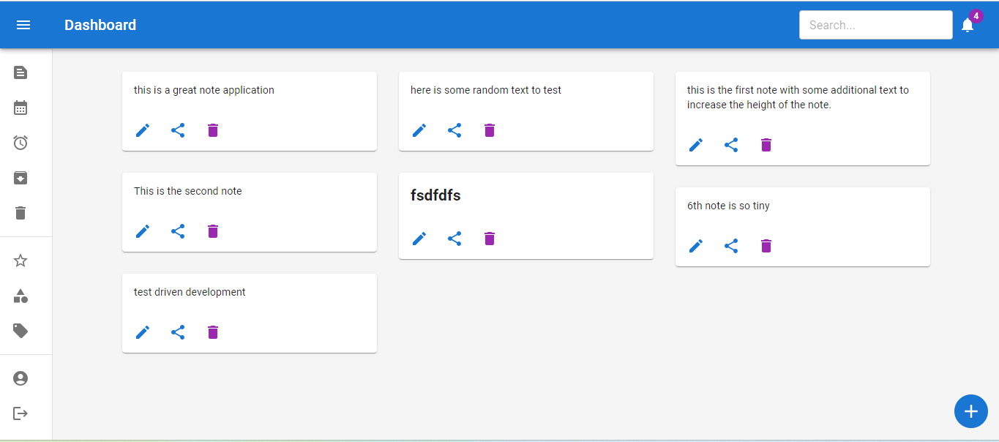
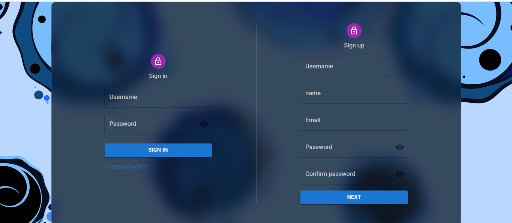
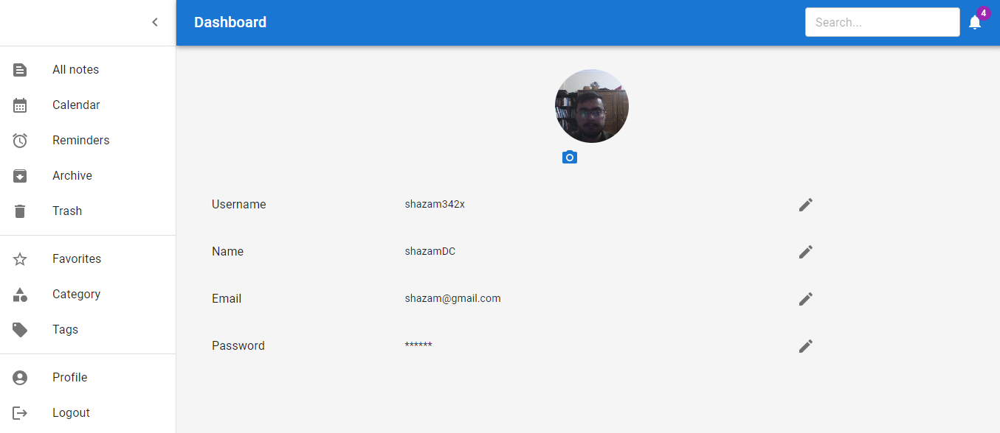
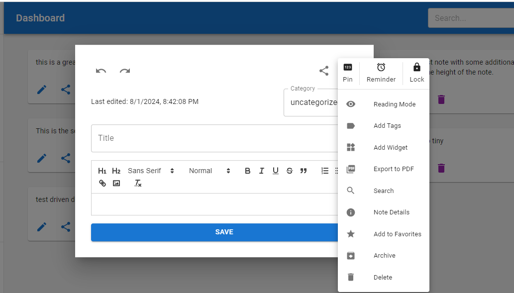
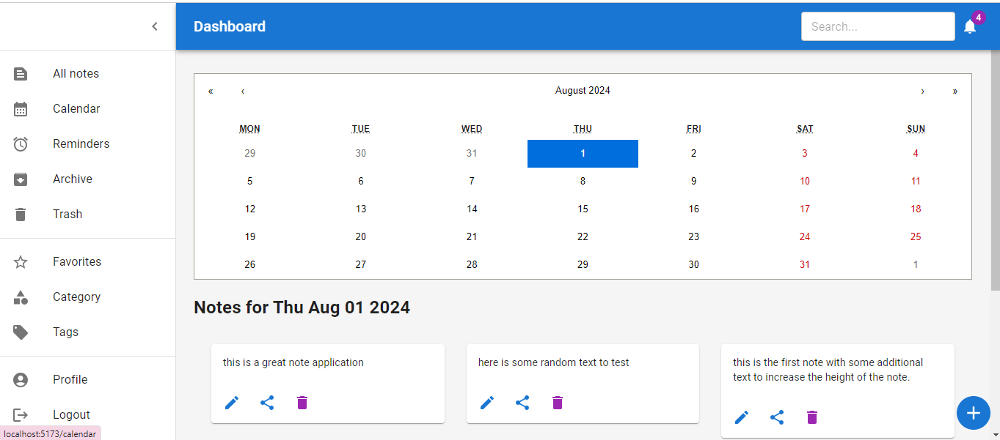

# MERN Note Application

This is a full-stack note-taking application built with the MERN (MongoDB, Express, React, Node.js) stack. It allows users to create, edit, share, and manage notes efficiently.

## Table of Contents

- [Features](#features)
- [Installation](#installation)
- [Usage](#usage)
- [API Endpoints](#api-endpoints)
- [Environment Variables](#environment-variables)
- [Testing](#testing)
- [Contributing](#contributing)
- [License](#license)

## Features

- User authentication and authorization
- Rich text editor for creating and editing notes
- Note sharing with other users
- Image upload and management
- Advanced search and filtering
- Calendar view for managing notes by date
- Responsive and user-friendly interface

## Screenshots

### Dashboard




### Authentication



### User Profile



### Note Modal



### Calendar




## Installation

### Prerequisites

- Node.js (v14 or higher)
- MongoDB
- Firebase account for image storage

### Backend Setup

1. Clone the repository:

    ```bash
    git clone https://github.com/ShehzadKhuwaja/shehzad-mern-10pshine.git
    cd shehzad-mern-10pshine/backend
    ```

2. Install dependencies:

    ```bash
    npm install
    ```

3. Create a `.env` file in the `backend` directory and add the following environment variables:

    ```env
    NODE_ENV=development
    PORT=5000
    MONGO_URI=your_mongodb_connection_string
    JWT_SECRET=your_jwt_secret
    ```

4. Start the backend server:

    ```bash
    npm run dev
    ```

### Frontend Setup

1. Navigate to the `frontend` directory:

    ```bash
    cd ../frontend
    ```

2. Install dependencies:

    ```bash
    npm install
    ```

3. Create a `.env` file in the `frontend` directory and add the following environment variables:

    ```env
    VITE_API_KEY=your_firebase_api_key
    ```

4. Start the frontend development server:

    ```bash
    npm run dev
    ```

## Usage

Once both the backend and frontend servers are running, you can access the application at `http://localhost:3000`.

## API Endpoints

### Auth

- `POST /api/auth/register` - Register a new user
- `POST /api/auth/login` - Log in a user

### Notes

- `GET /api/notes` - Get all notes
- `POST /api/notes` - Create a new note
- `GET /api/notes/:id` - Get a single note
- `PUT /api/notes/:id` - Update a note
- `DELETE /api/notes/:id` - Delete a note

### Users

- `GET /api/users` - Get all users
- `GET /api/users/:id` - Get a single user
- `PUT /api/users/:id` - Update a user
- `DELETE /api/users/:id` - Delete a user

## Environment Variables

Make sure to set the following environment variables in your `.env` files:

### Backend

- `NODE_ENV` - Environment (development/production)
- `PORT` - Port number
- `MONGO_URI` - MongoDB connection string
- `JWT_SECRET` - Secret key for JWT

### Frontend

- `VITE_API_KEY` - Firebase API key

## Testing

### Backend Tests

To run backend tests, use:

```bash
npm run test

### Backend Tests

To run frontend tests, use:

```bash
npm run test
